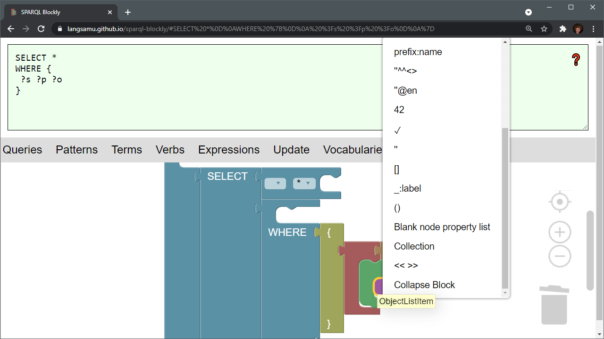

# SPARQL Blockly

SPARQL Blockly is an application for visualising and building SPARQL.

## Usage
- **[Try it online](https://langsamu.github.io/sparql-blockly/)**
- Get the [library from npm](https://www.npmjs.com/package/sparql-blockly)
- See the [examples](./examples)

## Features

SPARQL Blockly implements the SPARQL grammar in Blockly.

It supports SPARQL 1.1 Query, Update and SPARQL*.

It enables several ways of visual interaction with SPARQL:
- Dragging blocks from a toolbox unto a canvas to assemble valid queries.
- Adding clauses and patterns to query blocks using a context menu.
- Parsing SPARQL query text into blocks.
- Collapsing/expanding parts of a query assemblage.
- Sharing URLs of visual representations.

SPARQL is parsed using [SPARQL.js](https://github.com/RubenVerborgh/SPARQL.js/).

## Repo structure
This code-base consists of three parts:
- [npm package](./package): Source-code for the [JavaScript library hosted on npm](https://www.npmjs.com/package/sparql-blockly). 
- [Demo app](./demo): Source-code for the [demo application hosted on GitHub Pages](https://langsamu.github.io/sparql-blockly/).
- [Examples](./examples): Example JavaScript source-code explaining how to use the library in the browser and in node.
