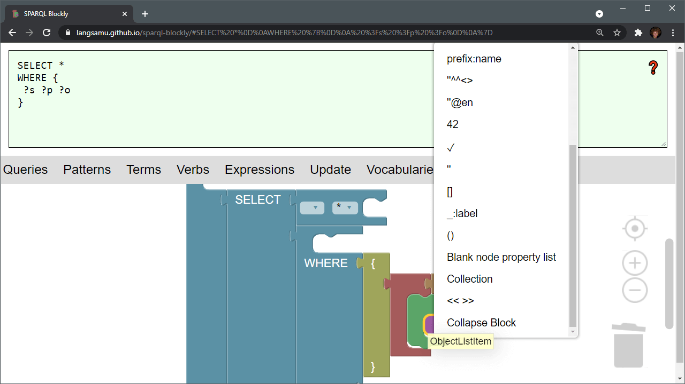

# SPARQL Blockly

SPARQL Blockly is a library for visualising and building SPARQL.

## Usage
- **[Try it online](https://langsamu.github.io/sparql-blockly/)**
- See the [examples](../examples)

## Features

SPARQL Blockly implements the [SPARQL](https://www.w3.org/TR/sparql11-query/) grammar in [Blockly](https://developers.google.com/blockly).

It supports SPARQL 1.1 Query, Update and SPARQL*.

It enables several ways of visual interaction with SPARQL:
- Dragging blocks from a toolbox unto a canvas to assemble valid queries.
- Adding clauses and patterns to query blocks using a context menu.
- Parsing SPARQL query text into blocks.
- Collapsing/expanding parts of a query assemblage.
- Sharing URLs of visual representations.

SPARQL is parsed using [SPARQL.js](https://github.com/RubenVerborgh/SPARQL.js/).
